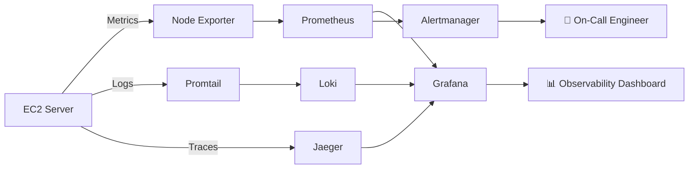

# 📊 SRE Observability Stack

## Overview

Built a production-style observability platform on AWS EC2 implementing the three pillars of observability—**metrics, logs, and traces**. The stack provides centralized monitoring, log aggregation, distributed tracing, SLO-based monitoring, and automated alerting to improve infrastructure visibility, troubleshooting, and reliability.

---

## Architecture

---

# Project Objectives

- Implement a complete observability solution for cloud infrastructure.
- Collect and visualize infrastructure metrics.
- Centralize application and system logs.
- Capture distributed traces for performance analysis.
- Configure Service Level Objectives (SLOs).
- Automate infrastructure alerting for proactive incident response.

---

# Technologies Used

| Technology | Purpose |
|------------|---------|
| Prometheus | Metrics collection and storage |
| Grafana | Dashboards and visualization |
| Node Exporter | Linux system metrics |
| Loki | Centralized log aggregation |
| Promtail | Log collection agent |
| Jaeger | Distributed tracing |
| Alertmanager | Alert routing and notifications |
| Docker Compose | Service orchestration |
| AWS EC2 | Infrastructure hosting |
| Ubuntu Linux | Operating System |

---

# Three Pillars of Observability

## 1. Metrics

Implemented Prometheus with Node Exporter to collect infrastructure metrics every 15 seconds.

Collected metrics include:

- CPU utilization
- Memory usage
- Disk utilization
- Network traffic
- System uptime
- Filesystem usage

---

## 2. Logs

Configured Loki and Promtail to centralize logs from multiple sources.

Log sources include:

- Linux system logs
- Docker container logs
- Application logs

This enables efficient troubleshooting and historical log analysis from a single interface.

---

## 3. Traces

Implemented distributed tracing using Jaeger to monitor request flow through applications.

Trace data provides visibility into:

- End-to-end request lifecycle
- Request latency
- Performance bottlenecks
- Service interactions

---

# Service Level Objectives (SLOs)

| Service Level Indicator | Target | Alert Threshold |
|-------------------------|--------|-----------------|
| Availability | 99.9% | Down for more than 1 minute |
| CPU Usage | < 90% | Warning at 80% |
| Memory Usage | < 85% | Warning at 75% |
| Disk Utilization | < 80% | Warning at 70% |

---

# Error Budget Policy

To balance feature delivery with system reliability, the following error budget policy was defined:

| Remaining Error Budget | Action |
|------------------------|--------|
| Above 50% | Continue normal development |
| 25–50% | Increase testing and monitoring |
| Below 25% | Freeze non-critical deployments |
| 0% | Prioritize reliability improvements |

---

# Monitoring Stack

- Prometheus
- Grafana
- Node Exporter
- Loki
- Promtail
- Jaeger
- Alertmanager
- Docker Compose
- AWS EC2 (Ubuntu)

---

# Screenshots

Add screenshots demonstrating:

- Grafana Infrastructure Dashboard
- Prometheus Targets
- Loki Log Explorer
- Jaeger Trace View
- Alertmanager Alerts
- Docker Compose Services

---

# Challenges Encountered

- Configuring communication between observability components.
- Ensuring Prometheus successfully scraped exporter metrics.
- Integrating Grafana with multiple data sources.
- Managing Docker Compose networking for all services.
- Defining meaningful SLOs and alert thresholds.

---

# Key Learnings

- Observability extends beyond monitoring by combining metrics, logs, and traces.
- Metrics indicate **what** happened.
- Logs explain **why** it happened.
- Traces reveal **where** latency occurs.
- SLOs provide measurable reliability goals.
- Error budgets help balance reliability with development velocity.
- Effective alerting enables proactive incident response instead of reactive troubleshooting.

---

# Future Improvements

- Integrate cloud-native monitoring with AWS CloudWatch.
- Add Slack and PagerDuty alert notifications.
- Monitor Kubernetes workloads.
- Build application-specific dashboards.
- Add long-term metrics and log retention.
- Secure Grafana with authentication and role-based access control.

---

## Author

**Chukwuebuka Emmanuel Orjide**

Cloud & DevOps Engineer

GitHub: https://github.com/Chukwuebuka127
